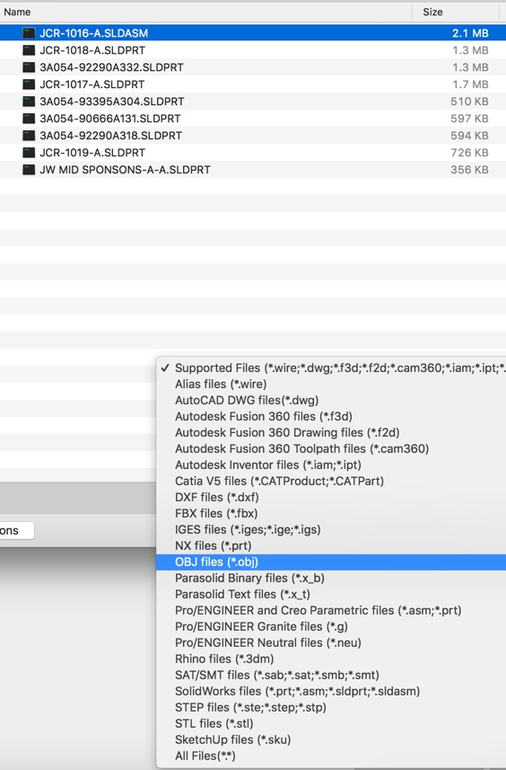
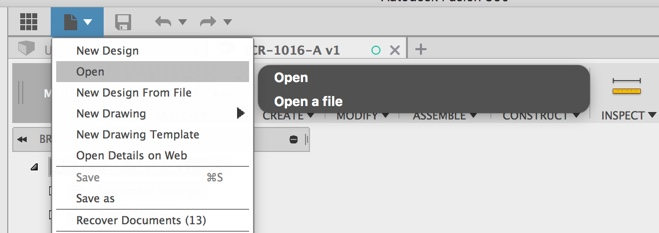
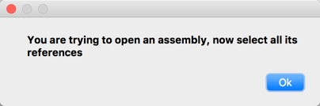

# FusionOpener
File Utility for Fusion 360

Consolidated File Open utility for Fusion 360

# Installation
[Click here to download the Add-in](https://github.com/tapnair/FusionBolter/archive/master.zip)

After downloading the zip file follow the [installation instructions here](https://tapnair.github.io/installation.html) for your particular OS version of Fusion 360

# Usage

Select File/Open from top menu

If you choose an assembly to open, you will be prompted to then select all of the children

If you select any of the following a local import will be performed and the data will not yet be uploaded to the cloud until you hit save.

 * Fusion Archive (.f3d) _Note: Only f3d and not f3z files are supported at this time_
 * STEP files (*.ste;*.step;*.stp)
 * SAT/SMT files (*.sab;*.sat;*.smb;*.smt)
 * IGES files (*.iges;*.ige;*.igs)

## License
Samples are licensed under the terms of the [MIT License](http://opensource.org/licenses/MIT). Please see the [LICENSE](LICENSE) file for full details.

## Written by
Written by [Patrick Rainsberry](https://twitter.com/prrainsberry)   (Autodesk Fusion 360 Business Development)

See more useful [Fusion 360 Utilities](https://tapnair.github.io/index.html)

